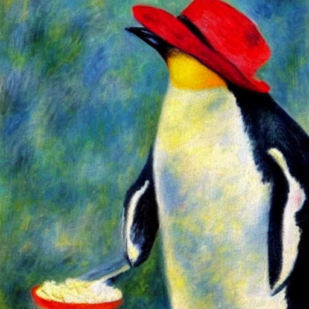
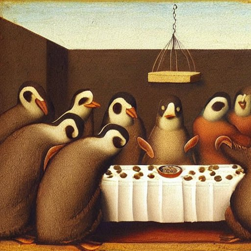

Using Distributions
===================

*penguin eating ice cream. Style by Renoir. Created with stablediffusionweb.com*

Exercise 1: Maintenance
-----------------------

The penguins are successfully running an ice cream factory.
From time to time, the ice cream machines in the factory have to be maintained.
Of the 10 machines, 2.2 stop working in an average month, and are brought back after a short break.

What is the probability that a single machine will produce ice cream for an entire year without being maintained?

Exercise 2: Body Mass
---------------------

After having a lot of ice cream, the penguins are slowly putting on weight for the coming winter.
The **Adelie** penguins have an average body mass of 3700 g and a standard deviation of 460 g.
Let's assume their weights are normally distributed.

Answer the following questions:

* Ada weighs exactly 3000g. Is she among the slimmest 10%?
* Bashir is weighing 3850g. How many penguins are between 3700 and 4000g
* Choi weighs 4600g. What is the chance that a single penguin is heavier?

**Optional:** Calculate the z-score for all three penguins.

Exercise 3: Ice Floe
--------------------

Now the penguins have to be a bit careful when they step on an ice floe.
A typical ice floe carries 8000g before capsizing.

Two penguins jump on an ice floe. What is the probability that they take a bath?

Exercise 4: Meet the Chinstraps
-------------------------------

The Chinstraps have been busy eating fish in the meantime.
Their weight has a mean of 3733 g and a standard deviation of 380 g.

Pairs of one Adelie and Chinstrap penguin compare their weight.
What is the probability that the Adelie penguin is heavier?

Exercise 5: Big Floe
--------------------

The penguins found a bigger ice floe that carries up to 40kg.
Is it safe enough to carry 10 penguins?

*The last ice cream. Style by Da Vinci. Created with stablediffusionweb.com*

