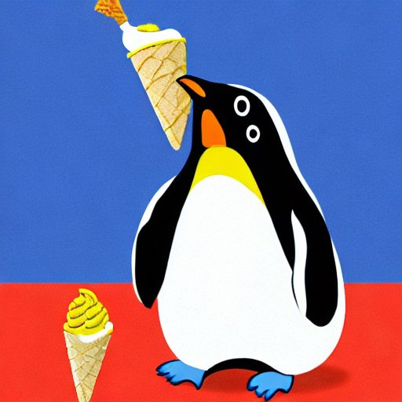

Session 5: Using Distributions
==============================

Exercise 1: Ice Cream
---------------------

In the summer, penguins like ice cream.
Every penguin has their own individual taste. 
Let's consider three penguins:

* **Ada** likes to have one scoop of each type available. They have to be piled up in a specific order.
* **Bashir** likes to have 2, 3 or 4 scoops. The order does not matter, but every type of ice cream must occur only once.
* **Choi** has a taste very similar to Bashir, but a type of ice cream may occur multiple times.

Create a table showing how many different ice cream cones one could build for each penguin.
Consider the following cases:

* 2 types of ice cream and 2 scoops
* 3 types of ice cream and 2 scoops
* 3 types of ice cream and 3 scoops
* 4 types of ice cream and 2 scoops
* 4 types of ice cream and 3 scoops
  

Exercise 2: Ice Cream Deluxe
----------------------------

The penguins have found an ice cream shop that offers 32 different types of ice cream.
Bashir seizes the opportunity and orders an ice cream with 7 scoops.
How many friends should he invite to try all possible combinations?

Exercise 3: Ice Cream Factory
-----------------------------

The penguins have found the ice cream factory.
The factory continuously produces ice cream scoops and puts them on a conveyor belt.

One in ten scoops is a mango ice cream scoop.
Choi grabs 10 scoops at random.
What is the probability that they have exactly 3 mango scoops?

Exercise 4: Packaging
---------------------

The scoops are packaged into boxes of 100 scoops.
What is the probability that a box will contain exactly 15 mango scoops?

**Optional:** What is the probability that a box contains 5 scoops *or less*?

Exercise 5: Maintenance
-----------------------

Like any engineering product, the ice cream machines in the factory have to be maintained.
Of the 10 machine, 2.2 stop working every month, and are brought back after a short break.

What is the probability that a single machine will produce ice cream for an entire year without being maintained?

.. figure:: renoir.jpeg
   :caption: penguin eating ice cream. Style by Renoir. Created with stablediffusionweb.com

Exercise 6: Body Mass
---------------------

After having a lot of ice cream, the penguins are slowly putting on weight for the coming winter.
The **Adelie** penguins have an average body mass of 3700 g and a standard deviation of 460 g.
Let's assume their weights are normally distributed.

Answer the following questions:

* Ada weighs exactly 3000g. Is she among the slimmest 10%?
* Bashir is weighing 3850g. How many penguins are between 3700 and 4000g
* Choi weighs 4600g. What is the chance that a single penguin is heavier?

**Optional:** Calculate the z-score for all three penguins.

Exercise 7: Ice Floe
--------------------

Now the penguins have to be a bit careful when they step on an ice floe.
A typical ice floe carries 8000g before capsizing.

Two penguins jump on an ice floe. What is the probability that they take a bath?

Exercise 8: Meet the Chinstraps
-------------------------------

The Chinstraps have been busy eating fish in the meantime.
Their weight has a mean of 3733 g and a standard deviation of 380 g.

Pairs of one Adelie and Chinstrap penguin compare their weight.
What is the probability that the Adelie penguin is heavier?

Exercise 9: Big Floe
--------------------

The penguins found a bigger ice floe that carries up to 40kg.
Is it safe enough to carry 10 penguins?

.. figure:: davinci.jpeg
   :caption: the last ice cream. Style by Da Vinci. Created with stablediffusionweb.com

